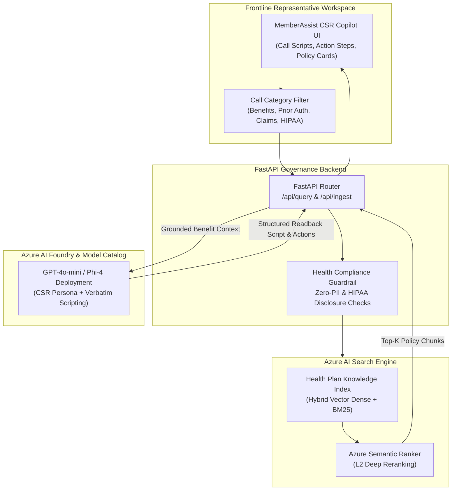

# MemberAssist: Health Insurance Knowledge Hub 🏥⚡

[](https://github.com/N8Space/intelligent-knowledge-hub/actions)
[](https://www.python.org/downloads/)
[](https://fastapi.tiangolo.com)
[](https://azure.microsoft.com/en-us/products/ai-services/ai-search)
[](https://ai.azure.com)
[](https://www.hhs.gov/hipaa)

> **Enterprise AI Retrieval Assistant for Health Insurance Customer Service Representatives (CSRs) & Member Advocates**  
> Enables frontline call center agents to instantly resolve complex member inquiries regarding 2026 PPO benefit schedules, out-of-network coinsurance, prior authorization SLAs, No Surprises Act balance billing disputes, and HIPAA privacy rules with zero-hallucination policy grounding.

---

## 📌 Executive Summary & Business ROI

Health insurance call centers face high operational costs and member friction due to complex benefit schedules, changing clinical authorization policies, and strict compliance mandates:
* **Average Handle Time (AHT) Reduction:** Cuts policy lookup and verification time from 4–6 minutes down to **<700ms**, dramatically accelerating call wrap-up.
* **First Contact Resolution (FCR) Improvement:** Provides CSRs with verbatim member-facing readback scripts and step-by-step CRM workflows to resolve inquiries on the first call.
* **100% Policy Grounding:** Enforces strict citations against 2026 Plan Schedules (`PLAN-PPO-2026-BENEFITS`), Utilization Management SOPs (`SOP-UM-2026-004`), and Claims Guides (`GUIDE-CLM-2026-012`).
* **Regulatory Compliance:** Built-in validation for HIPAA 45 CFR disclosures and federal No Surprises Act (NSA) emergency/ancillary provider balance billing protections.

---

## 🏛️ System Architecture



---

## 📂 Health Insurance Policy Corpus (`data/policies/`)

| Document ID | Policy Title | Category | Key Regulatory Standards |
| :--- | :--- | :--- | :--- |
| `PLAN-PPO-2026-BENEFITS` | Commercial Premier & Standard PPO Schedule (2026) | Benefit Schedule | ACA Preventive ($0 Copay), Out-of-network MRI/Imaging, Rx Tiers |
| `SOP-UM-2026-004` | Prior Authorization & Clinical Appeals SOP | Prior Authorization | 72h Standard / 24h Urgent SLA, 5-Day Peer-to-Peer (P2P) Window |
| `GUIDE-CLM-2026-012` | Claims Denial Explanation & EOB Resolution Guide | Claims Operations | CO-16 Missing Records, No Surprises Act (NSA) Balance Billing Hold |
| `SOP-HIPAA-2026-001` | HIPAA Privacy Verification & Authorized Disclosures | Privacy & Compliance | 3 of 4 Identifier Check, Spouse/Dependent PHI-AUTH-01 Mandate |

---

## 🚀 Quick Start (Local Development)

### 1. Clone the Repository
```bash
git clone https://github.com/N8Space/intelligent-knowledge-hub.git
cd intelligent-knowledge-hub
```

### 2. Configure Environment & Run
```bash
# Copy environment configuration
cp .env.example .env

# Run FastAPI server
uvicorn app.main:app --reload --host 0.0.0.0 --port 8000
```
Open **`http://localhost:8000`** in your browser to access the CSR workspace.

---

## 📡 API Contract Overview (`POST /api/query`)

```json
{
  "query": "What is the member cost share for an out-of-network MRI under the Standard PPO plan?",
  "top_k": 3,
  "call_type": "Benefit Schedule",
  "strict_governance_only": true
}
```

---

## 🔗 Live Application & Portfolio Links

* **Live Cloud Application (Azure App Service):**  
  👉 **[https://intelligent-knowledge-hub-lesterlabs.azurewebsites.net](https://intelligent-knowledge-hub-lesterlabs.azurewebsites.net)**
* **Portfolio Showcase Case Study:**  
  👉 **[https://winelogbooks.com/projects/intelligent-knowledge-hub](https://winelogbooks.com/projects/intelligent-knowledge-hub)**
* **GitHub Repository:**  
  👉 **[https://github.com/N8Space/intelligent-knowledge-hub](https://github.com/N8Space/intelligent-knowledge-hub)**
