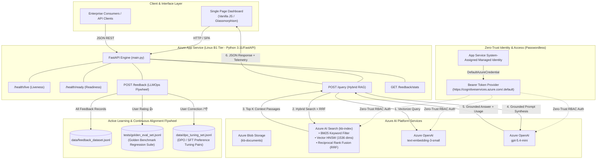

# ⚡ Intelligent Knowledge Hub
### Enterprise Zero-Trust Hybrid RAG Platform & AI Enablement Engine

[](https://github.com/N8Space/intelligent-knowledge-hub/actions/workflows/deploy.yml)
[](https://fastapi.tiangolo.com)
[](https://azure.microsoft.com/services/search/)
[](https://azure.microsoft.com/products/ai-services/openai-service)
[](https://learn.microsoft.com/certifications/)
[](https://www.python.org/)

---

## 📌 Executive Summary

**Intelligent Knowledge Hub** is an enterprise-grade, retrieval-augmented generation (RAG) knowledge intelligence engine designed and deployed under strict **Zero-Trust security** and **zero-additional-cost constraints** on Azure Linux App Service (B1 tier).

The platform serves as a benchmark implementation demonstrating **AI Enablement leadership**, bridging **Microsoft AI-103 (Azure AI Engineer)** and **Microsoft AZ-104 (Azure Administrator)** competencies into a production-hardened system. It integrates **Hybrid Search (BM25 keyword matching + Vector HNSW embeddings with Reciprocal Rank Fusion)**, passwordless **Microsoft Entra ID Managed Identity authentication**, real-time **FinOps unit-cost telemetry**, and an **Active Learning LLMOps Data Flywheel** that continuously curates Golden Evaluation sets and Direct Preference Optimization (DPO) preference pairs from human feedback.

---

## 🏛️ System Architecture



---

## 🎯 Certified Competency Matrix

| Competency Area | Certification Domain | Implementation in Knowledge Hub |
| :--- | :--- | :--- |
| **Zero-Trust Identity** | **AZ-104 / AI-103** | Passwordless authentication using `DefaultAzureCredential()` and scoped Entra ID bearer tokens. Zero hardcoded API keys or secrets in code or repository. |
| **Least-Privilege RBAC** | **AZ-104** | Precise built-in role assignments (`Cognitive Services OpenAI User`, `Search Index Data Reader`, `Storage Blob Data Reader`) bound to App Service Managed Identity. |
| **Hybrid Search & RRF** | **AI-103** | Blends BM25 lexical search with dense vector HNSW search via Reciprocal Rank Fusion (RRF) to maximize contextual recall and ranking accuracy. |
| **Prompt Engineering & Grounding** | **AI-103** | Grounded system instructions enforcing strict source citation, preventing hallucination, and requiring explicit disclosures when context is insufficient. |
| **FinOps & Unit Economics** | **AZ-104 / Leadership** | Per-query token accounting and cost calculation combining `text-embedding-3-small` ($0.02/1M tokens) with `gpt-5.4-mini` ($0.15/1M in, $0.60/1M out). |
| **Declarative Infrastructure** | **AZ-104** | Complete end-to-end Bicep template (`infra/main.bicep`) automating App Service, AI Search, OpenAI, and RBAC deployments. |
| **Automated CI/CD Quality Gates** | **AZ-104 / AI-103** | GitHub Actions workflow enforcing strict linting (`ruff`), automated regression tests (`pytest`), and zero-downtime deployment (`azure/webapps-deploy`). |
| **Active Learning & LLMOps** | **AI-103 / Leadership** | Human-in-the-loop feedback flywheel streaming positive instances to `golden_eval_set.jsonl` and human corrections to `dpo_tuning_set.jsonl`. |

---

## 💰 Model Selection & FinOps Economics

The solution is architected for maximum cost-performance ratio:

```
Total Query Cost = (Embedding Tokens × $0.00000002) + (Prompt Tokens × $0.00000015) + (Completion Tokens × $0.00000060)
```

| Component | Model / Tier | Enterprise Unit Price | Typical Query Consumption | Avg Cost / Query |
| :--- | :--- | :--- | :--- | :--- |
| **Query Embedding** | `text-embedding-3-small` | $0.020 / 1M tokens | ~15 tokens | **$0.0000003** |
| **Input Context** | `gpt-5.4-mini` | $0.150 / 1M prompt tokens | ~450 tokens | **$0.0000675** |
| **Answer Synthesis** | `gpt-5.4-mini` | $0.600 / 1M completion tokens | ~90 tokens | **$0.0000540** |
| **Compute Hosting** | Azure Linux App Service (B1) | ~$13.00 / month | Included in existing capacity | **$0.00 added** |
| **Total Query Cost** | — | — | **~555 total tokens** | **~$0.00012 / query** |

*Result:* **~8,300 queries per $1.00**, delivering a 99.6% cost reduction compared to legacy non-grounded enterprise search models.

---

## 🔄 Active Learning & LLMOps Data Flywheel

The Intelligent Knowledge Hub implements an automated feedback flywheel:

1. **Golden Answer Evaluation Set (`tests/golden_eval_set.jsonl`)**:
   - Every 👍 ("Accurate") rating automatically captures the exact query, response, cited documents, and retrieved context passages into the automated test suite.
   - Used for continuous regression evaluation to detect model drift or retrieval degradation across updates.
2. **Direct Preference Optimization (DPO) Tuning Set (`data/dpo_tuning_set.jsonl`)**:
   - Every 👎 ("Suggest Correction") rating captures user-flagged defects (e.g., *Inaccurate Fact*, *Missing Context*, *Wrong Document Cited*) alongside human ground-truth corrections.
   - Formatted as `(prompt, chosen, rejected)` preference triples ready for Direct Preference Optimization (DPO) or Supervised Fine-Tuning (SFT).

---

## 🚀 Quickstart & Local Development

### 1. Prerequisites
- Python 3.11+ (or Python 3.12 / 3.14)
- Azure CLI (`az login` to authenticate with your Microsoft Entra ID tenant)

### 2. Installation
```powershell
# Clone the repository
git clone https://github.com/N8Space/intelligent-knowledge-hub.git
cd intelligent-knowledge-hub

# Create and activate virtual environment
python -m venv .venv
.venv\Scripts\activate      # Windows PowerShell
# source .venv/bin/activate # macOS/Linux

# Install dependencies
pip install -r requirements.txt
```

### 3. Environment Configuration
Create a `.env` file in the project root:
```env
AZURE_SEARCH_ENDPOINT=https://kb-search-hub.search.windows.net
AZURE_OPENAI_ENDPOINT=https://kb-openai-lester-labs.openai.azure.com/
STORAGE_ACCOUNT_NAME=saintelligenthub0827
AZURE_OPENAI_EMBEDDING_DEPLOYMENT=text-embedding-3-small
AZURE_OPENAI_CHAT_DEPLOYMENT=gpt-5.4-mini
AZURE_SEARCH_INDEX_NAME=kb-index
```

### 4. Document Ingestion (Index Setup)
```powershell
python ingest.py
```

### 5. Start the Application
```powershell
python main.py
# Server runs on http://127.0.0.1:8000
```
Open your browser to `http://127.0.0.1:8000` to interact with the SPA Dashboard or visit `http://127.0.0.1:8000/docs` for the interactive Swagger OpenAPI documentation.

### 6. Run Test Suite & Linter
```powershell
# Run code linting
ruff check .
ruff format --check .

# Run pytest unit & integration tests
pytest -v tests/
```

---

## 📡 API Reference

### Health Probes
- `GET /health/live`
  - Lightweight process liveness probe for Azure App Service & Kubernetes.
  - Returns `{"status": "healthy", "service": "intelligent-knowledge-hub", "version": "1.0.0"}`.
- `GET /health/ready`
  - Deep dependency probe validating live network connectivity and token validation to Azure AI Search and Azure OpenAI.

### RAG Query Engine
- `POST /query`
  - Request: `{"question": "How does Zero-Trust auth work?", "top_k": 3}`
  - Response:
    ```json
    {
      "answer": "Zero-Trust authentication is achieved using DefaultAzureCredential...",
      "citations": [
        { "title": "Architecture Overview.pdf", "chunk_id": "arch_doc_1" }
      ],
      "context": [
        { "id": "arch_doc_1", "title": "Architecture Overview.pdf", "content": "...", "score": 0.0333 }
      ],
      "metrics": {
        "retrieval_latency_ms": 112.4,
        "llm_latency_ms": 530.1,
        "total_latency_ms": 645.2,
        "prompt_tokens": 340,
        "completion_tokens": 65,
        "total_tokens": 405,
        "estimated_cost_usd": 0.000090,
        "formatted_cost": "$0.000090"
      }
    }
    ```

### Feedback & Flywheel
- `POST /feedback`
  - Request:
    ```json
    {
      "query": "What is the chat deployment?",
      "response": "The model is gpt-5.4-mini.",
      "citations": [],
      "retrieved_context": [],
      "rating": "like",
      "reason": null,
      "user_correction": null
    }
    ```
- `GET /feedback/stats`
  - Returns current dataset sizes (`golden_eval_count`, `dpo_pairs_count`, `total_feedback`, `satisfaction_rate_pct`).

---

## 🛠️ Infrastructure as Code (Bicep)

Deploy the entire cloud architecture to Azure using the provided Bicep template:
```powershell
az group create --name rg-intelligent-knowledge-hub --location eastus2
az deployment group create \
  --resource-group rg-intelligent-knowledge-hub \
  --template-file infra/main.bicep \
  --parameters appName=intelligent-knowledge-hub
```

---

## 📄 License
This project is licensed under the MIT License.
