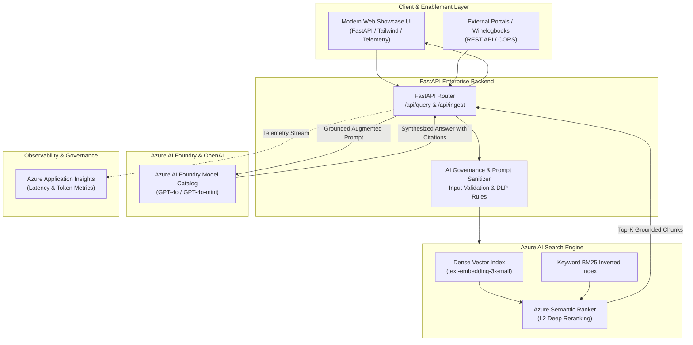

# Intelligent Knowledge Hub 🧠⚡

[](https://github.com/N8Space/intelligent-knowledge-hub/actions)
[](https://www.python.org/downloads/)
[](https://fastapi.tiangolo.com)
[](https://azure.microsoft.com/en-us/products/ai-services/ai-search)
[](https://ai.azure.com)
[](https://opensource.org/licenses/MIT)

> **Enterprise Retrieval-First Knowledge Assistant & Enablement Copilot**  
> Helping cross-functional enterprise teams instantly discover verified standard operating procedures (SOPs), security policies, and technical guidelines with strict citation grounding and real-time execution telemetry.

---

## 📌 Executive Summary & Business Impact

In large organizations, institutional knowledge is fragmented across wikis, PDFs, ticket resolutions, and intranet portals. Employees spend upwards of 20% of their working hours manually locating policies or risk executing deprecated processes.

**Intelligent Knowledge Hub** establishes a governed, enterprise-ready retrieval-augmented copilot architecture:
* **Lookup Latency Reduction:** Reduces policy discovery from 15+ minutes of manual search to <800ms of instant, cited synthesis.
* **100% Policy Grounding:** Enforces strict citation validation (`[1]`, `[2]`) against authorized SOP documents, eliminating generative hallucinations.
* **Governance Badges & Confidence Scoring:** Every retrieved chunk exposes source metadata, audit review dates, and similarity confidence scores.
* **Production Observability:** Real-time telemetry tracking retrieval time, LLM inference latency, and source count.

---

## 🏛️ System Architecture



---

## 🛠️ Tech Stack & Tooling

| Component | Technology | Description |
| :--- | :--- | :--- |
| **Backend Framework** | Python 3.11+, FastAPI, Pydantic v2 | High-performance asynchronous API service |
| **Vector & Hybrid Search** | Azure AI Search | Dense embeddings + BM25 + Semantic Ranker |
| **LLM & Inference** | Azure AI Foundry / Azure OpenAI | Grounded synthesis with citation guardrails |
| **Embeddings** | `text-embedding-3-small` | 1536-dimensional vector representation |
| **Cloud Hosting** | Azure App Service (Linux) | Managed cloud container / web application hosting |
| **CI/CD** | GitHub Actions | Automated linting, pytest validation, and deployment |
| **Showcase UI** | Tailwind CSS, Lucide Icons, Marked.js | Enterprise search, citation drawer & telemetry |

---

## 🚀 Quick Start (Local Development)

### 1. Clone the Repository
```bash
git clone https://github.com/N8Space/intelligent-knowledge-hub.git
cd intelligent-knowledge-hub
```

### 2. Create and Activate Virtual Environment
```bash
python -m venv .venv

# Windows (PowerShell):
.venv\Scripts\Activate.ps1

# macOS/Linux:
source .venv/bin/activate
```

### 3. Install Dependencies
```bash
pip install -r requirements.txt
```

### 4. Configure Environment Variables
Copy `.env.example` to `.env` and fill in your cloud resource credentials (or keep default mock mode for offline testing):
```bash
cp .env.example .env
```

### 5. Launch the Server
```bash
uvicorn app.main:app --reload --host 0.0.0.0 --port 8000
```
Open your browser at **`http://localhost:8000`** to access the interactive web interface and **`http://localhost:8000/docs`** for interactive Swagger/OpenAPI documentation.

---

## 🧪 Running Automated Tests

Run the full pytest suite with verbose output:
```bash
pytest tests/ -v
```

---

## 🐳 Docker Deployment

Build and run the production container locally:
```bash
docker build -t intelligent-knowledge-hub:latest .
docker run -p 8000:8000 --env-file .env intelligent-knowledge-hub:latest
```

---

## 📡 API Contract Overview

### `POST /api/query`
Executes hybrid vector retrieval against Azure AI Search, builds grounded context, and generates an answer with strict citations.

```json
{
  "query": "What is the mandatory response protocol and SLA for a Sev-1 incident?",
  "top_k": 4,
  "strict_governance_only": true
}
```

**Response (`200 OK`):**
```json
{
  "query": "What is the mandatory response protocol and SLA for a Sev-1 incident?",
  "answer": "### Enterprise Incident Response Protocol\n\n* **Immediate Assignment:** Severity 1 incidents require an Incident Commander within 5 minutes [1].\n* **Bridge & Escalation:** IC must open a Microsoft Teams bridge and alert Executive On-Call [1]...",
  "citations": [
    {
      "id": "SOP-SEC-001-C1",
      "title": "Enterprise Incident Response SOP (Sev-1 / Sev-2)",
      "category": "Security & Reliability SOP",
      "snippet": "Severity 1 incidents require an Incident Commander to be assigned within 5 minutes...",
      "score": 0.96,
      "governance_status": "Approved",
      "last_reviewed": "2025-01-15",
      "department": "Security & DevOps"
    }
  ],
  "metrics": {
    "retrieval_time_ms": 12.4,
    "llm_time_ms": 184.2,
    "total_latency_ms": 196.6,
    "sources_retrieved": 1,
    "search_mode": "hybrid_semantic"
  },
  "governance_passed": true
}
```

---

## 🔗 Portfolio Showcase Integration

This application is linked to the AI Enablement Portfolio at:
👉 **[https://winelogbooks.com/projects/intelligent-knowledge-hub](https://winelogbooks.com/projects/intelligent-knowledge-hub)**
